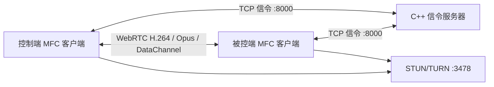

# WebRTC C++ 远程桌面

基于 **C++、MFC 和 libwebrtc** 的 Windows P2P 远程桌面程序，配套一个可在 Windows/Linux 构建的 C++ `select` 信令服务器。客户端使用 DXGI 采集桌面、D3D11 渲染远端画面，优先 H.264 + Opus，并通过 WebRTC DataChannel 传输键盘鼠标事件。

> 当前仓库是 Windows x64 工程。信令服务器源码跨 Windows/Linux；MFC 客户端仅支持 Windows 10/11 x64。

## 已实现功能

- 地址、端口、用户 ID 登录和在线用户管理
- 双击在线用户发起连接，支持挂断后重新连接
- 推送/拉取远端桌面视频，可独立控制音频发送和接收
- DXGI Desktop Duplication 桌面采集，目标 30 FPS
- libwebrtc H.264 视频与 Opus 音频传输，STUN/TURN 穿透和中继
- D3D11 远端视频渲染，适应窗口/原始尺寸切换
- 独立全屏渲染窗口，退出全屏后恢复主界面渲染
- DataChannel 键鼠控制，归一化坐标和 Windows `SendInput`
- Media Foundation H.264 MP4 录制
- RTT、丢包率、帧率、码率、分辨率等会话统计
- C++ `select` 信令服务器，Windows/Linux 双平台

## 项目结构

```text
webrtc-cpp-remote-control/
├─ README.md                         项目入口、构建与使用说明
├─ SECURITY.md                       凭据和生产部署安全基线
├─ LICENSE-libwebrtc.txt             随附 libwebrtc 二进制的许可证
├─ config/
│  └─ remote-control.env.example     STUN/TURN 环境变量模板（无真实密码）
├─ docs/
│  └─ ARCHITECTURE.md                分层、数据流、线程与协议说明
├─ include/                           libwebrtc C++ 包装层头文件
├─ lib/
│  ├─ libwebrtc.dll                  Windows x64 WebRTC 运行库
│  └─ libwebrtc.dll.lib              MSVC 导入库
├─ packages/
│  ├─ RemoteControl_rtc_x64_Full_20260722_GitHub.zip  完整运行依赖包
│  └─ SHA256SUMS.txt                 ZIP 校验值
└─ RemoteControl_rtc/
   ├─ RemoteControl_rtc.slnx         Visual Studio 解决方案
   ├─ RemoteControl_rtc/             MFC 客户端源码和工程
   ├─ SignalingServer/               C++ select 信令服务器（Win/Linux）
   └─ ConnectionSmokeTest/           WebRTC 连接冒烟测试
```

更详细的模块关系见 [程序架构](docs/ARCHITECTURE.md)。

## 架构概览



## 构建客户端

准备环境：

- Windows 10/11 x64
- Visual Studio，安装“使用 C++ 的桌面开发”和 MFC
- 与工程匹配的 `v145` 平台工具集及 Windows SDK

步骤：

1. 用 Visual Studio 打开 `RemoteControl_rtc/RemoteControl_rtc.slnx`。
2. 选择 `Release | x64`。
3. 构建 `RemoteControl_rtc`。
4. 保证 `lib/libwebrtc.dll` 位于生成的 EXE 同目录后运行。

Release 配置静态链接 MFC 和 MSVC C/C++ 运行库，目标电脑通常不需要单独安装 Visual C++ Runtime。可从 [packages 目录](packages/) 直接下载完整运行包。

## 构建信令服务器

Windows 可在解决方案中构建 `SignalingServer`。Linux 使用 CMake：

```bash
cd RemoteControl_rtc/SignalingServer
cmake -S . -B build -DCMAKE_BUILD_TYPE=Release
cmake --build build --config Release -j
./build/SignalingServer 0.0.0.0 8000
```

## 网络与 ICE 配置

默认信令地址为 `150.158.3.4:8000`，STUN/TURN 地址为 `150.158.3.4:3478`。仓库不保存 TURN 凭据。运行客户端前在 Windows PowerShell 中配置：

```powershell
$env:REMOTE_CONTROL_STUN_URI = 'stun:150.158.3.4:3478'
$env:REMOTE_CONTROL_TURN_UDP_URI = 'turn:150.158.3.4:3478?transport=udp'
$env:REMOTE_CONTROL_TURN_TCP_URI = 'turn:150.158.3.4:3478?transport=tcp'
$env:REMOTE_CONTROL_TURN_USERNAME = '<your-turn-username>'
$env:REMOTE_CONTROL_TURN_PASSWORD = '<your-turn-password>'
.\RemoteControl_rtc.exe
```

未提供 TURN 用户名和密码时，客户端仍启用 STUN，但不会添加无凭据的 TURN 配置。

需要开放的主要端口：

| 服务 | 协议/端口 | 用途 |
|---|---|---|
| 信令 | TCP 8000 | 登录、在线状态、SDP 和 ICE Candidate |
| STUN/TURN | UDP/TCP 3478 | NAT 探测和中继分配 |
| TURN Relay | 服务器配置的 UDP 端口范围 | 实际媒体中继 |

## 运行与发布包

下载：[RemoteControl_rtc_x64_Full_20260722_GitHub.zip](packages/RemoteControl_rtc_x64_Full_20260722_GitHub.zip)

SHA-256：`83BF2A11A6B582CBE489A84FF2D9B723561B6A34FA0FF943CE06789557A804CA`

完整依赖包包含：

- `RemoteControl_rtc.exe`
- `libwebrtc.dll`
- `d3dcompiler_47.dll`
- 环境检查脚本、依赖说明、许可证和 SHA-256 校验文件
- Microsoft 官方 `vc_redist.x64.exe` 兼容兜底安装程序

Windows N/KN 版本需安装 Media Feature Pack。DXGI 采集需要支持 Desktop Duplication 的显卡驱动；锁屏、安全桌面或部分远程会话可能无法采集。

## 安全与授权

远程控制功能应只用于经过明确授权的设备。生产部署前必须为信令增加 TLS、身份认证、限流和审计，并轮换曾经硬编码或分享过的 TURN/服务器凭据。详情见 [SECURITY.md](SECURITY.md)。

本仓库没有为项目源码声明开源许可证；`LICENSE-libwebrtc.txt` 仅适用于随附的第三方 libwebrtc 二进制及其对应组件。
