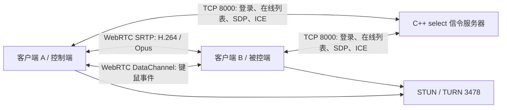

# 程序架构

## 总体数据流

信令服务器只负责用户上线状态和 WebRTC 协商，不转发媒体。媒体优先 P2P 直连，NAT 条件不允许时由 TURN 中继。

## 客户端分层

| 层 | 主要类 | 职责 |
|---|---|---|
| MFC 界面 | `CRemoteControlrtcDlg`、`VideoRenderWnd` | 登录、在线用户、呼叫/挂断、控制开关、全屏、录制、统计与日志 |
| 会话编排 | `SessionManager`、`PeerSession` | PeerConnection 生命周期、Offer/Answer、ICE、轨道、DataChannel、统计 |
| 信令 | `SignalingClient`、`SignalingProtocol` | TCP 长连接、JSON 行协议、用户在线状态和协商消息 |
| 桌面视频 | `DxgiDesktopCapturer`、`DesktopCaptureManager` | DXGI Desktop Duplication 采集、30 FPS 节流、送入 WebRTC 视频源 |
| 远端渲染 | `RemoteVideoRenderer`、`VideoRenderWnd` | I420 帧接收、D3D11 纹理上传、适应窗口/原始尺寸/独立全屏窗口 |
| 音频 | `LocalAudioManager` | 音频设备与发送/接收策略，WebRTC 使用 Opus |
| 远程输入 | `RemoteControlChannel`、`InputInjectorWin` | 归一化坐标、鼠标/键盘 DataChannel 消息、Windows `SendInput` 注入 |
| 录制 | `RemoteVideoRecorder` | Media Foundation H.264 MP4 录制，处理图像方向和停止收尾 |

## 线程与生命周期

- MFC 主线程只处理窗口和用户操作。
- 网络接收、WebRTC 回调、视频采集和渲染在各自工作线程运行。
- 跨线程 UI 更新通过窗口消息回到主线程。
- 挂断时先停止录制和输入控制，再拆除渲染目标、媒体轨道、PeerConnection，最后恢复可重连状态。

## 信令协议

协议采用“一行一个 JSON 对象”。核心流程：

1. 客户端发送 `login`，服务器广播在线列表。
2. 主叫创建 Offer，经服务器转发给被叫。
3. 被叫创建 Answer，经服务器回传。
4. 双方持续交换 ICE Candidate。
5. ICE 选择直连或 TURN 中继路径，媒体和 DataChannel 建立。
6. 任一方发送 `hangup` 后双方释放会话资源。

## 画面与坐标

收到的视频帧只渲染到当前目标窗口：普通模式为主界面视频控件，全屏模式切换到独立 D3D 窗口。输入坐标先依据实际视频显示区域去除黑边，再归一化到 `[0,1]`，被控端映射到虚拟桌面坐标并调用 Windows 输入 API。
